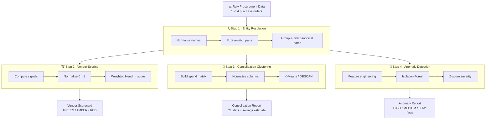
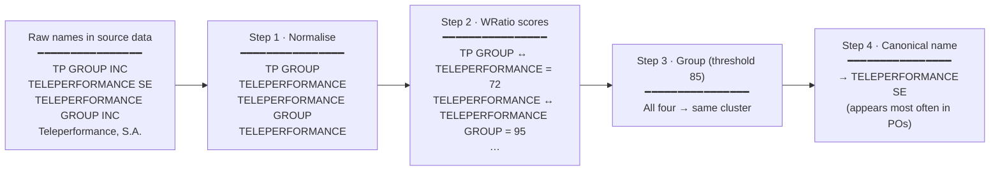
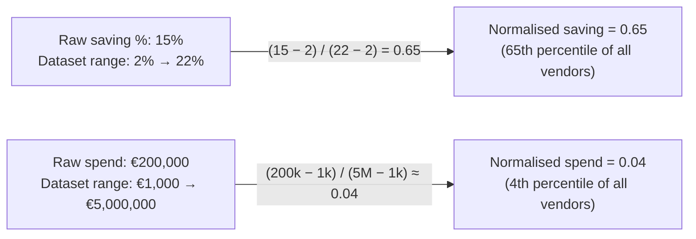
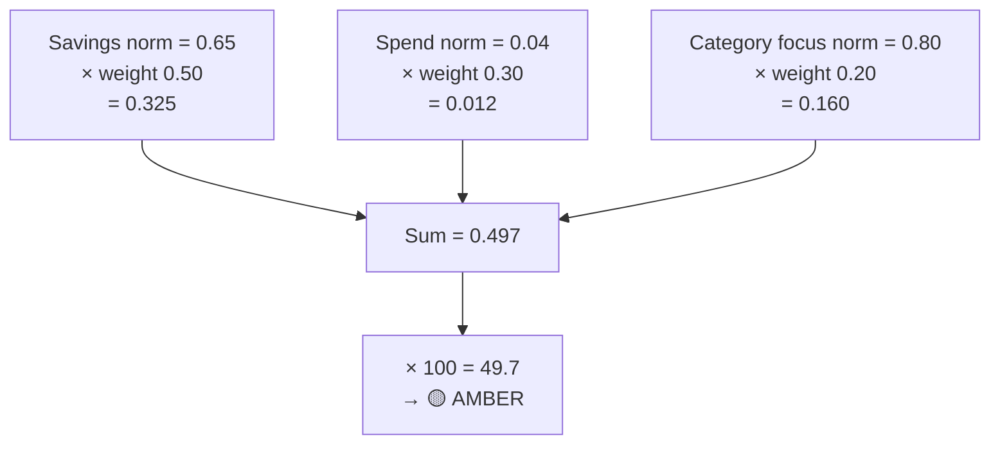
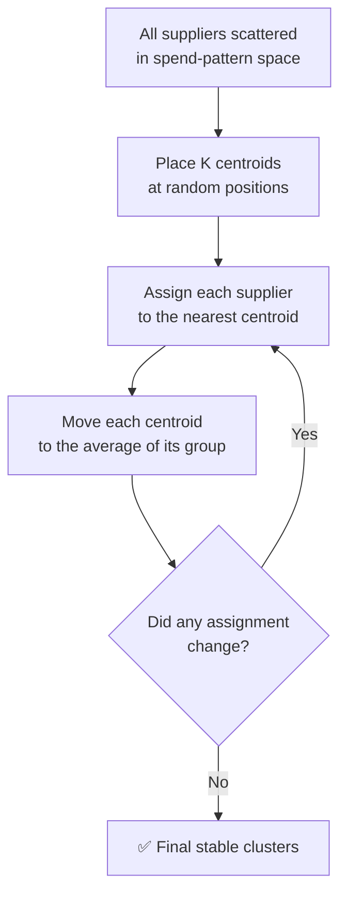
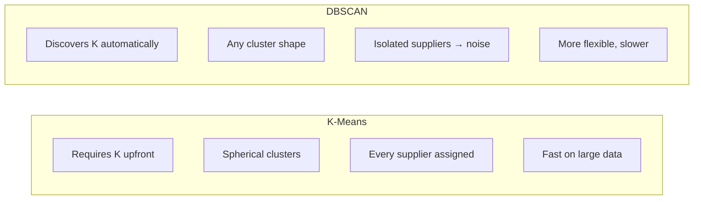
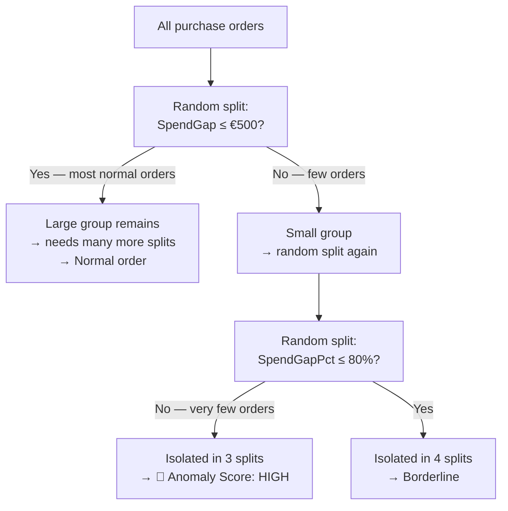
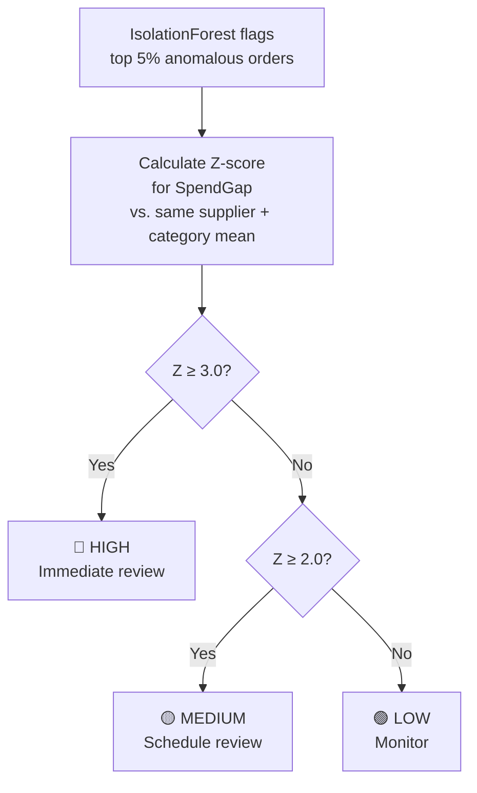
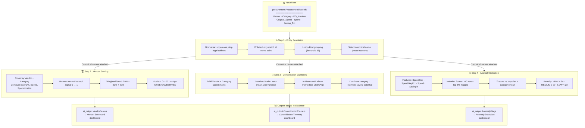

# AI Capabilities Guide — Supplier Intelligence Platform

**For: Procurement Managers, Category Buyers, Finance Analysts**

---

## What Does This Platform Do?

The Supplier Intelligence Platform automatically analyses your procurement data to answer three
questions that previously required hours of manual work:

1. **Which suppliers are performing well?** — The platform grades each supplier in each
   category on a 0–100 scale, so you can immediately see your top performers and those
   who need attention.

2. **Where can we reduce the number of suppliers?** — The platform finds groups of
   suppliers delivering similar goods or services and estimates how much you could save
   by consolidating to fewer, better-performing vendors.

3. **Which purchase orders look unusual?** — The platform flags orders where the final
   amount paid differs significantly from what was originally agreed, helping your team
   catch potential overruns, pricing errors, or unauthorized changes before they become
   problems.

All analysis runs automatically on your procurement data. No spreadsheets, no manual
calculations.

---

## 1. Vendor Ranking

### What the score means

Every supplier is given a score from **0 to 100** — think of it like a school grade.
A score of 85 means the supplier is performing very well; a score of 25 means there is
significant room for improvement.

### GREEN / AMBER / RED bands

| Band | Score Range | What it means | Recommended action |
|------|------------|---------------|-------------------|
| 🟢 **GREEN** | 70 – 100 | Strong performer | Continue partnership; consider expanding scope |
| 🟡 **AMBER** | 40 – 69 | Average performer | Review contract; set improvement targets |
| 🔴 **RED** | 0 – 39 | Underperformer | Escalate review; consider alternatives |
| ⚪ **INSUFFICIENT DATA** | — | Too few orders to score | Gather more data before evaluating |

A supplier only receives an INSUFFICIENT DATA band if it has fewer than 3 purchase orders
in a category — this prevents unfair judgements based on a single transaction.

### What feeds the score

The composite score blends three signals:

| Signal | Default weight | What it measures |
|--------|---------------|-----------------|
| **Savings performance** | 50% | How much the supplier consistently saves vs. original price |
| **Spend volume** | 30% | How significant this supplier is to your total spend |
| **Category focus** | 20% | How specialised the supplier is in this category vs. spreading across many |

All three signals are compared against all other suppliers before being combined, so
the score always reflects relative performance, not absolute numbers.

### How to adjust scoring priorities

Open the file `ml-engine/config/model_config.yml` in any text editor. You will see:

```yaml
vendor_scoring:
  saving_pct_weight: 0.50    # ← how much savings matter
  spend_weight: 0.30         # ← how much spend volume matters
  specialization_weight: 0.20  # ← how much category focus matters
```

**Examples:**
- If savings are your top priority: increase `saving_pct_weight` to 0.70, reduce the others
- If you want to prioritise high-spend suppliers: increase `spend_weight`
- The three weights do not need to add up to 1.0 — the system normalises them automatically

After saving the file, trigger a new ML run (see section 7) to apply the changes.

---

## 2. Vendor Consolidation

### What a "cluster" means

The platform groups your suppliers by how similar their spending patterns are across
categories. A **cluster** is a group of suppliers who are all delivering similar goods or
services in the same spend area.

For example, if you have four IT Software vendors each receiving annual spend of
€50,000–€150,000, the platform will group them into one cluster and flag it as a
consolidation opportunity.

### Spend at stake and estimated saving potential

- **Spend at stake** — the total annual spend across all vendors in the cluster. This is
  the budget you could potentially renegotiate.
- **Estimated saving potential** — the difference between the best performer's saving rate
  and the average saving rate across the cluster. This is what you could theoretically
  save by consolidating to the top performer.

### Example narrative

> *Cluster 3 contains 4 IT Software vendors. Their combined annual spend is €550,000.
> The best vendor in this group achieves 18% savings; the cluster average is 12%.
> Consolidating to the top performer could save an estimated €33,000 per year.*

### How to start a consolidation initiative

1. Open the **Consolidation Treemap** in the Superset dashboard
2. Identify the largest clusters with the highest estimated saving
3. Click through to see the individual vendors in each cluster
4. Take the cluster to your next category review meeting
5. Negotiate with the top-performing vendor to take on additional scope

---

## 3. Anomaly Detection

### What an anomaly is

An anomaly is a purchase order where **the final amount paid differs significantly from
what was originally agreed**. This could indicate:

- A price increase that was never formally approved
- A quantity change that slipped through without a contract amendment
- A billing error or duplicate charge
- In rare cases, a fraudulent transaction

The platform does not assume fraud — it simply flags orders that look statistically
unusual so your team can investigate.

### HIGH / MEDIUM / LOW severity

| Severity | What it means | Suggested action |
|----------|--------------|-----------------|
| 🔴 **HIGH** | The spend gap is extremely unusual — more than 3 standard deviations from the norm for this supplier and category | Immediate review with procurement and finance team |
| 🟡 **MEDIUM** | The gap is notable — between 2 and 3 standard deviations | Schedule for review in next category meeting |
| 🟢 **LOW** | Flagged by the AI model but within a more typical range | Monitor; no immediate action required |

### How to read the reason text

Every flagged order shows a reason string. For example:

> *"Spend exceeds original by 45.2% (1,234.56 absolute); 3.1σ above TELEPERFORMANCE SE - IT Software mean gap"*

In plain English this means:
- The final amount paid was 45.2% higher than originally agreed
- The absolute overrun was €1,234.56
- Compared to other TELEPERFORMANCE SE IT Software orders, this overrun is 3.1 times
  larger than normal — the "σ" (sigma) symbol means "standard deviations above average"

### What to do when a HIGH anomaly appears

1. Open the **Anomaly Detection** dashboard in Superset
2. Filter to **HIGH** severity
3. Note the PO number and supplier name
4. Pull the original purchase order from your procurement system
5. Compare the original agreed price with the invoiced amount
6. Escalate to the relevant category buyer and finance business partner

### How to tune sensitivity

Open `ml-engine/config/model_config.yml` and adjust `contamination_factor`:

```yaml
anomaly_detection:
  contamination_factor: 0.05   # 5% of orders flagged
```

- **Increase** (e.g. to 0.10): More orders flagged — better for catch-all audits
- **Decrease** (e.g. to 0.02): Only the most extreme outliers flagged — better for focused investigation

After saving, trigger a new ML run (section 7) to apply the change.

---

## 4. How the AI Works (Non-Technical Overview)

### Supplier name standardisation

Your procurement system may record the same supplier under slightly different names:
"TP GROUP INC", "TELEPERFORMANCE GROUP, INC.", "TELEPERFORMANCE SE". The platform
automatically recognises that these are all the same company and groups them under one
**canonical name** before running any analysis. This means you see one score for
Teleperformance, not four separate entries.

### Vendor ranking algorithm

The system calculates a composite grade by combining three signals — savings performance,
spend volume, and category focus — and blends them according to the weights you configure.
Each signal is compared against all other suppliers first (so a "10% saving" means
something different if everyone else achieves 15% vs. 5%), then the weighted blend is
scaled to a 0–100 score.

### Consolidation clustering

The system builds a mathematical fingerprint for each supplier — a picture of how much
they spend across each category. It then groups suppliers whose fingerprints look similar
using a technique called **K-Means clustering**. The platform automatically determines
the right number of groups from your data. No manual input is needed.

### Anomaly detection

The system learns what "normal" looks like for each supplier and category by studying
the historical pattern of spend gaps (difference between agreed price and final invoice).
It then uses a statistical model called **Isolation Forest** to identify individual orders
that don't fit the normal pattern. Because it learns from your specific data, it doesn't
need any pre-defined rules or historical anomaly labels to get started.

---

## 5. The Theory Behind Each AI Module

This section explains *how* and *why* each AI module works the way it does. You do not need
any programming or data science background — we will use analogies, plain language, and
diagrams throughout.

---

### 5.1 What is Machine Learning?

**Machine Learning (ML)** is a branch of computer science where a program **learns patterns
from data** instead of following hand-written rules.

- **Traditional software** says: *"if the spend exceeds €50,000, flag it."*
- **A machine learning model** says: *"show me 1,000 past orders, and I will figure out
  what 'unusual' looks like on my own."*

The advantage is that ML adapts to your specific data. It does not need a human expert to
decide every threshold and rule in advance — it discovers the thresholds that make sense
for your supply base.

The platform uses four AI/ML techniques, each solving a different problem:

| Module | Problem solved | Technique family |
|--------|---------------|-----------------|
| Entity Resolution | Same supplier, different spellings | Fuzzy string matching + graph clustering |
| Vendor Scoring | Who is performing best? | Weighted composite scoring with normalisation |
| Consolidation | Which suppliers can be merged? | Unsupervised clustering (K-Means / DBSCAN) |
| Anomaly Detection | Which orders look suspicious? | Statistical outlier detection (Isolation Forest + Z-scores) |

Here is the high-level flow of how all four modules connect:



---

### 5.2 Entity Resolution — Recognising the Same Supplier

#### The Problem

Procurement systems often record the same company under slightly different names depending
on who typed the purchase order:

- `TELEPERFORMANCE SE`
- `TELEPERFORMANCE GROUP INC`
- `TP GROUP INC`
- `Teleperformance, S.A.`

Without fixing this, the AI would treat these as four separate suppliers and produce four
small, misleading scores instead of one accurate picture of Teleperformance's performance.

#### The Solution: Fuzzy String Matching

The module does not require an exact match. Instead, it measures **how similar** two names
are using a score from 0 to 100, where 100 = identical and 0 = completely different.

Think of it like predictive text on your phone: it suggests "Teleperformance" even when you
typed "Teleperforemance" — it found the closest match despite the typo.

#### How it Works Step by Step

**Step 1 — Normalise**
Convert everything to uppercase, strip legal suffixes (SA, INC, LTD, GMBH, SARL, CORP…),
and collapse extra spaces. This removes noise before comparing.

**Step 2 — Compare**
Calculate a similarity score between every pair of supplier names using a technique called
*WRatio* — a combination of several string-distance measures that handles abbreviations,
word reordering, and partial matches well.

**Step 3 — Group**
Any two names scoring ≥ 85 out of 100 are treated as the same company. Grouping is
transitive: if A matches B and B matches C, then A, B, and C are all in the same group —
even if A and C were never directly compared. This is done with a data structure called
**Union-Find** (also known as Disjoint Set Union).

**Step 4 — Pick a canonical name**
Within each group, the name that appears most often across all purchase orders becomes the
"official" canonical name going forward.



#### Why 85 as the Threshold?

At 85, minor typos and common abbreviations are caught while clearly different companies
are not accidentally merged. The threshold is configurable in `model_config.yml`:

- **Raise to 95**: Stricter — only near-identical names merge (safer but may miss variants)
- **Lower to 70**: More aggressive — catches distant abbreviations (more merges, higher risk
  of false positives)

---

### 5.3 Vendor Scoring — How the Grade is Calculated

#### The Concept: Weighted Composite Scoring

Vendor scoring is a transparent, explainable formula — not a "black box". Think of it like
rating a job candidate across three criteria (Technical skill, Communication, Experience)
where each criterion has a different importance weight.

#### Step 1 — Collect the Raw Signals

For each **vendor + category** pair (e.g. *TELEPERFORMANCE SE in IT Software*), three
numbers are calculated:

| Signal | How it is calculated |
|--------|---------------------|
| **Savings performance** | Average saving % across all purchase orders for this vendor and category |
| **Spend volume** | Total € spend across all purchase orders for this vendor and category |
| **Category focus** | This vendor's spend in this category ÷ their total spend across all categories |

Category focus rewards specialists: a vendor doing 90% of their business in IT Software
will score higher on this signal than a generalist vendor spread across 10 categories.

#### Step 2 — Normalise (Put Everyone on the Same Scale)

Raw numbers cannot be compared directly. A vendor with €10 million in spend and a vendor
with €50,000 in spend cannot both get a "10 out of 10" score on volume just because the
numbers happen to be similar on paper.

The system uses **min-max normalisation**:

> **Normalised score = (your value − lowest value in the dataset) ÷ (highest value − lowest value)**

After normalisation, the worst performer on each signal gets **0** and the best gets **1**.
Everyone else falls between 0 and 1 — making comparison fair regardless of the original units.



#### Step 3 — Blend with Weights

The three normalised scores are multiplied by their weights and summed:

> **Composite = (0.50 × Savings) + (0.30 × Spend) + (0.20 × Category focus)**

The result is then multiplied by 100 to give a 0–100 score.



#### Why Scores are Relative, Not Absolute

Because normalisation divides by the dataset's own range, a "10% saving" means something
very different depending on your supply base:

- If all your vendors save 8–12%: 10% would score around 0.5 (median)
- If your vendors range from 1–20%: 10% would also score around 0.5

This means **scores reflect how a vendor performs compared to your own supply base**, not
against an external benchmark. Scores will naturally shift slightly between pipeline runs
as new suppliers and orders are added.

---

### 5.4 Consolidation Clustering — Finding Natural Supplier Groups

#### The Concept: Unsupervised Learning

Unlike vendor scoring (which follows a fixed formula), consolidation uses **unsupervised
machine learning**. The key word is *unsupervised*: the algorithm finds patterns in the
data without being told what to look for. Nobody tells it "group IT suppliers together" —
it discovers natural groupings purely from spend behaviour.

Contrast this with *supervised* learning (not used here), where the algorithm is trained
on labelled examples: "here are 500 past consolidation decisions — learn from them."
Unsupervised learning works without any historical decisions to learn from.

#### Step 1 — Build a Spend Fingerprint

The system creates a matrix (a table of numbers) where each row represents one supplier
and each column represents one category. Each cell contains the total spend for that
supplier in that category (0 if they do not operate in that category):

| Supplier | IT Software | Facilities | Consulting | Legal |
|----------|------------|-----------|-----------|-------|
| Vendor A | 200,000 | 0 | 50,000 | 0 |
| Vendor B | 180,000 | 0 | 70,000 | 0 |
| Vendor C | 0 | 300,000 | 0 | 0 |
| Vendor D | 0 | 280,000 | 0 | 0 |

Vendors A and B have similar fingerprints (IT Software + Consulting); C and D look alike
(Facilities only). The algorithm will find these two groups automatically.

#### Step 2 — Standardise the Fingerprint

A category with €10 million in spend would dominate the maths over one with €50,000.
**StandardScaler** normalisation centres each category column around 0 and gives each
column equal weight — so no single category drowns out the others.

#### Step 3 — K-Means Clustering

K-Means is one of the most widely used clustering algorithms. Here is the intuition:

1. Randomly place **K** "centre points" (called *centroids*) somewhere in the data
2. Assign each supplier to the nearest centroid
3. Move each centroid to the average position of its assigned suppliers
4. Repeat steps 2–3 until the assignments stop changing



**Choosing K — The Elbow Method**

K-Means requires knowing K in advance (how many clusters to form). The platform uses the
**elbow method** to find K automatically:

1. Run K-Means for K = 2, 3, 4 … up to 10
2. At each K, measure *inertia* — the total distance between each supplier and its cluster
   centre (lower = tighter clusters)
3. Plot inertia vs. K. It always decreases as K increases, but at some point the
   improvement becomes marginal
4. Pick the K where the improvement drops below 15% — this is the "elbow" point

The name comes from the shape of the curve: it bends sharply at the optimal K and then
flattens, like an arm with an elbow.

#### DBSCAN — An Alternative for Complex Data

For datasets where clusters have irregular shapes or many suppliers do not fit neatly into
any group, the platform can switch to **DBSCAN** (Density-Based Spatial Clustering of
Applications with Noise):



DBSCAN works by looking at **density**: a cluster is a region where suppliers are packed
closely together in spend-pattern space. Isolated suppliers that are far from any dense
region are labelled as *noise* and excluded from consolidation reports — which is useful
when you have a few truly unique vendors with no peers.

#### Step 4 — Interpret Each Cluster

Once clusters are formed, the system characterises each one:

- **Dominant category**: whichever category has the highest average spend in the cluster
- **Estimated saving potential**: the gap between the best vendor's saving rate and the
  cluster average — what you could gain by consolidating to the top performer
- **Estimated saving amount**: saving potential × total cluster spend

---

### 5.5 Anomaly Detection — Spotting the Unusual

#### The Concept: Learning What "Normal" Looks Like

Traditional rule-based systems use fixed thresholds: "flag any PO over €50,000."
The problem is context: a €50,000 order may be perfectly normal for one supplier and
wildly unusual for another. **Isolation Forest** learns the normal pattern from your
actual data and flags deviations relative to that baseline — no manual thresholds needed.

#### The Features Used

For each purchase order, four numbers are calculated and fed to the model:

| Feature | What it captures |
|---------|-----------------|
| **SpendGap** | Final spend minus original agreed price (positive = overrun, negative = underspend) |
| **SpendGapPct** | SpendGap expressed as a % of the original price |
| **Spend** | The final amount actually paid |
| **Saving_Pct** | The saving rate recorded on this purchase order |

Using four features together means the model can catch cases where no single number looks
extreme, but the combination of values is unusual.

#### How Isolation Forest Works

The core idea is deceptively simple: **unusual data points are easier to isolate than
normal ones**.

Imagine a crowd of people standing in a field. To isolate a person standing in the middle
of the crowd, you need to draw many dividing lines. To isolate someone standing far from
the group at the edge of the field, you only need one or two lines.

Isolation Forest does exactly this with data:

1. Randomly select one of the four features (e.g. SpendGap)
2. Randomly select a split value within that feature's range
3. Divide the data: records above and below the split go into separate branches
4. Repeat until every record is isolated in its own branch
5. Count how many splits were needed to isolate each record

**Anomalies are isolated in very few splits. Normal records need many more splits to separate.**



The system builds **100 such trees** — each using different random splits and different
random subsets of the data. The final anomaly score is the average isolation depth across
all 100 trees. Using many trees together (called an **ensemble**) makes the result much
more robust than relying on any single tree.

The `contamination_factor` (default 0.05) tells the model to flag approximately the top 5%
most anomalous orders. The remaining 95% are considered normal.

#### How Severity is Assigned — Z-Scores

A high anomaly score tells you *that* an order is unusual. The severity (HIGH / MEDIUM / LOW)
tells you *how* unusual it is in context, using **Z-scores**:

> **Z-score = (this order's SpendGap − average SpendGap for this supplier + category) ÷ standard deviation**

In plain English: *"How many times the typical variation does this overrun represent?"*

If the average SpendGap for Vendor A in IT Software is €1,000 with a standard deviation of
€500, and one order has a SpendGap of €2,500:

> Z-score = (2,500 − 1,000) / 500 = **3.0** → 🔴 HIGH

| Z-score | Plain English | Severity |
|---------|--------------|---------|
| ≥ 3.0 | More than 3× the normal variation — extremely rare | 🔴 **HIGH** |
| 2.0 – 3.0 | 2–3× normal variation — clearly notable | 🟡 **MEDIUM** |
| < 2.0 | Within a more typical range | 🟢 **LOW** |

A Z-score of 3 means that, assuming a normal distribution, you would expect to see this
level of overrun by chance in fewer than **0.3% of orders**. It is not impossible — but
it is worth investigating.



#### Why Use Both Isolation Forest AND Z-Scores?

They answer complementary questions and each has strengths the other lacks:

| | Isolation Forest | Z-Score |
|--|-----------------|---------|
| **What it detects** | Orders unusual across multiple features simultaneously | How extreme the spend gap is for this specific supplier and category |
| **Requires historical data?** | No — works on any dataset from the first run | Yes — needs enough orders to calculate a meaningful average |
| **Strength** | Catches complex multi-dimensional outliers | Gives a human-readable, contextual explanation |
| **Output** | Anomaly score 0–1 | Numerical deviation with direction and magnitude |

Using both together gives you better detection accuracy **and** a plain-English reason
string that your team can act on immediately.

---

### 5.6 The Full AI Pipeline — End to End

The diagram below shows how all four modules connect, from raw data to final outputs:



---

### 5.7 Key ML Concepts — Quick Reference Glossary

| Concept | Plain-English Definition |
|---------|------------------------|
| **Machine Learning (ML)** | A program that learns patterns from data rather than following hand-written rules |
| **Unsupervised learning** | ML where the algorithm finds patterns without labelled training examples — it has no "correct answers" to learn from |
| **Supervised learning** | ML where the algorithm is trained on labelled examples (not used in this platform) |
| **Normalisation** | Rescaling numbers from different ranges onto the same scale so they can be fairly compared |
| **Min-max normalisation** | Rescaling so the lowest value = 0 and the highest = 1; used in vendor scoring |
| **StandardScaler** | Normalisation that centres data around 0 with equal spread; used before clustering |
| **Weighted composite score** | A single number combining multiple signals according to their configured importance weights |
| **Clustering** | Automatically grouping similar items together without being told what groups should exist |
| **K-Means** | A clustering algorithm that groups data into K clusters by minimising the distance from each point to its cluster centre |
| **Centroid** | The "centre of gravity" of a cluster — the average position of all points in that group |
| **Inertia (K-Means)** | A measure of cluster tightness — the sum of squared distances from each point to its centroid; lower = tighter |
| **Elbow method** | Technique to choose K by plotting inertia vs. K and finding where improvement levels off |
| **DBSCAN** | A density-based clustering algorithm that finds clusters of any shape and marks isolated points as noise |
| **Isolation Forest** | An anomaly detection algorithm that isolates unusual records using random data splits; records needing fewer splits are more anomalous |
| **Ensemble** | Combining many models (e.g. 100 isolation trees) and averaging their outputs for more robust predictions |
| **Contamination factor** | The proportion of records the anomaly model expects to be anomalous; 0.05 = top 5% flagged |
| **Z-score** | Measures how many standard deviations a value is from the mean; Z = 3 means the value is extremely unusual |
| **Standard deviation (σ)** | A measure of spread — how much individual values vary from the average |
| **Fuzzy matching** | Comparing strings for similarity rather than exact equality — "ACME Inc" and "Acme, Inc." would score ~95 |
| **WRatio** | A fuzzy matching score (0–100) combining multiple string-distance measures, optimised for real-world company names |
| **Union-Find** | A data structure that efficiently groups items where transitivity applies: if A~B and B~C, all three are grouped together |
| **Canonical name** | The single standardised name chosen to represent all variants of a supplier name in the source data |
| **Spend fingerprint** | A numerical vector describing a supplier's spend distribution across all categories |
| **Dominant category** | The category with the highest average spend within a consolidation cluster |

---

## 6. Interpreting the Dashboards

### Vendor Ranking dashboard (Superset)

- **Bar chart** — top 20 vendors by composite score; use the category filter to focus
  on a specific category
- **Pie chart** — distribution across GREEN / AMBER / RED; a large RED segment indicates
  a widespread performance issue in your supply base
- **Sortable table** — full list of all scored vendor+category pairs; sort by score,
  filter by band or category

### Anomaly Detection dashboard

- **Anomaly table** — all flagged POs with severity badge and reason string; click any
  row to see the full detail
- **Score histogram** — distribution of anomaly scores; a heavy right tail means many
  borderline cases; sharp peaks near 1.0 indicate clear outliers

### Consolidation Treemap dashboard

- **Treemap** — each box represents a cluster; box size = total spend at stake;
  colour = estimated saving potential; bigger + darker = highest priority
- **Member table** — click a cluster to see which vendors belong to it and their
  individual spend totals

---

## 7. How to Trigger a Fresh Analysis

The ML pipeline analyses your latest procurement data and refreshes all scores,
clusters, and anomaly flags. You can trigger it in two ways:

### Via the API (no terminal required)

1. Open your browser and go to: http://localhost:8080/swagger
2. Find the section **Admin**
3. Click **POST /api/v1/admin/ml/trigger**
4. Click **Try it out**
5. Enter `{"runType": "FULL"}` in the request body
6. Click **Execute**
7. You will receive a `202 Accepted` response with a `run_id`
8. Check progress at **GET /api/v1/admin/ml/status**

The analysis typically completes within 1–3 minutes for 1,734 records.

### Via Superset

Superset dashboards refresh automatically when you open them if new data exists.
To force an immediate refresh, click the **↻ Refresh** icon on any dashboard.

---

## 8. Glossary

| Term | Plain-English meaning |
|------|-----------------------|
| **OPEX** | Operational expenditure — day-to-day running costs (e.g. maintenance contracts, software subscriptions) |
| **CAPEX** | Capital expenditure — one-time investments in assets (e.g. building construction, major equipment) |
| **Saving %** | The percentage by which the final price was reduced versus the original price. Stored as a decimal (0.15 = 15% savings). Displayed in the API as a percentage (× 100). |
| **Canonical vendor name** | The standardised, "correct" name chosen by the system to represent a supplier, even when the source data spells it differently across orders |
| **Contamination factor** | A configuration parameter (0–0.5) controlling how many orders the anomaly model flags. 0.05 means the model expects 5% of orders to be unusual. Higher = more flags; lower = fewer, more extreme flags only. |
| **Composite score** | A single number (0–100) combining three performance signals according to your configured weights |
| **σ (sigma)** | Standard deviation — a measure of how far a value is from the average. "3σ above mean" means the value is three standard deviations higher than typical, which is very unusual. |
| **Cluster** | A group of suppliers with similar spending patterns across categories, identified automatically by the AI |
| **Spend at stake** | The total annual spend across all vendors in a consolidation cluster — the budget that could be renegotiated |
